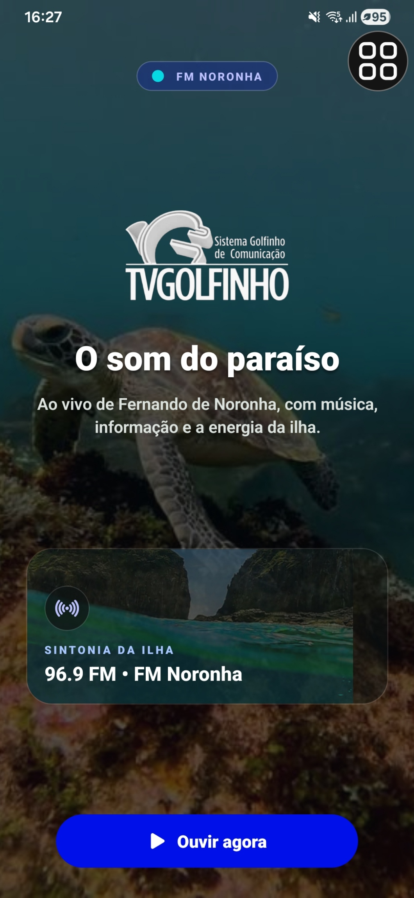
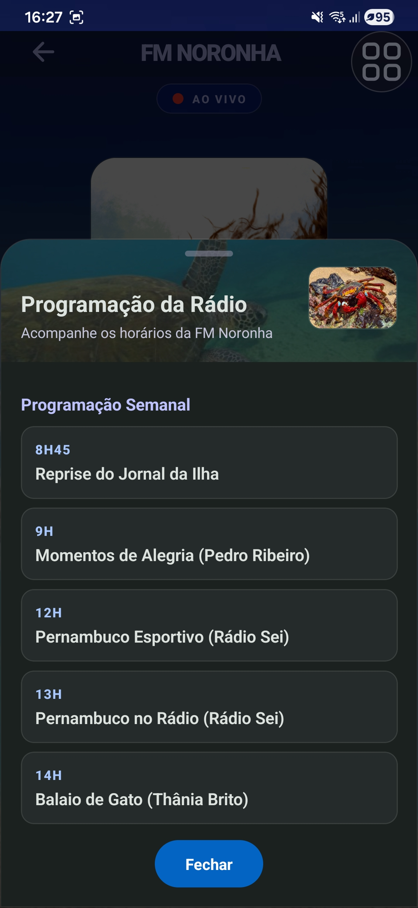
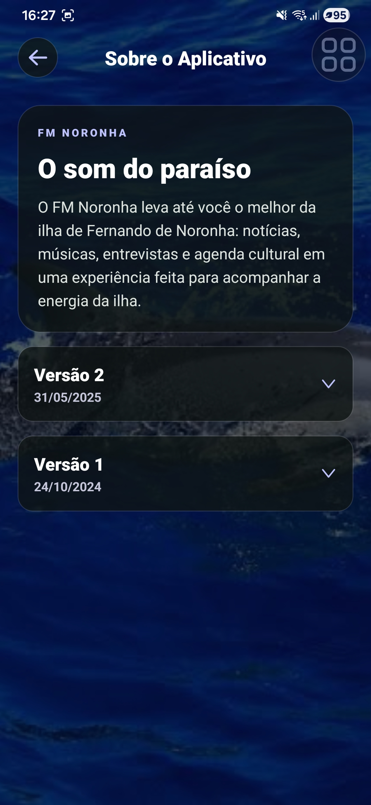
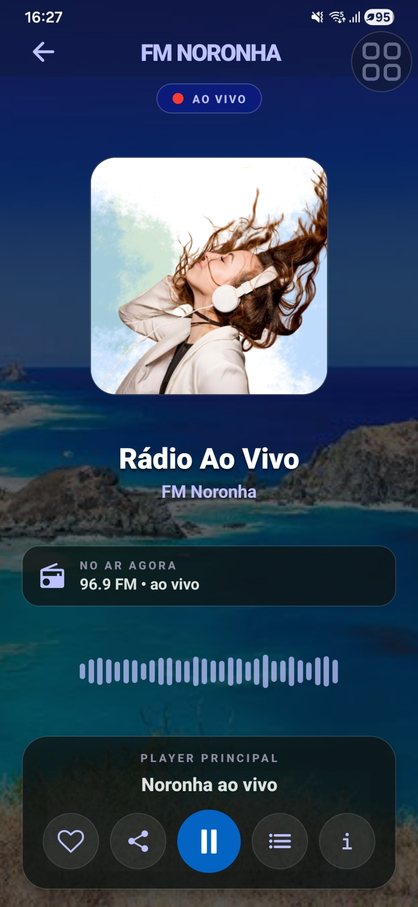
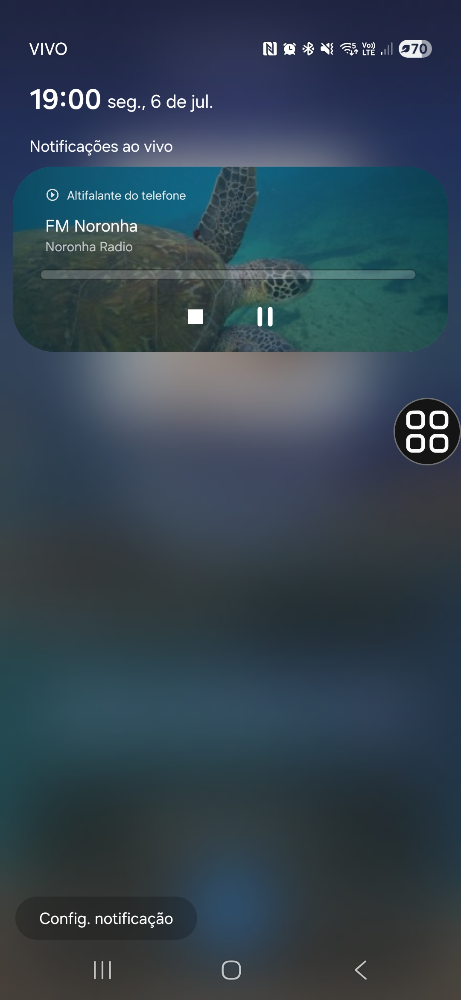

<p align="center">
  
</p>

<h1 align="center">FM Noronha</h1>

<p align="center">
  <strong>O som do paraiso, ao vivo de Fernando de Noronha.</strong><br />
  Aplicativo Expo/React Native para streaming da New FM Noronha, com player nativo, programacao, redes sociais e visual oceanico.
</p>

<p align="center">
  
  
  
  
</p>

<p align="center">
  <a href="#visao-geral">Visao geral</a> ·
  <a href="#interface">Interface</a> ·
  <a href="#desenvolvimento">Desenvolvimento</a> ·
  <a href="#build-e-update">Build e Update</a> ·
  <a href="./docs/DESIGN.md">Design</a> ·
  <a href="./docs/RELEASE.md">Release</a>
</p>

## Visao Geral

FM Noronha e um app mobile com foco em escuta ao vivo, identidade visual de ilha e controles nativos de midia no Android. A experiencia atual usa fundo fotografico, cards com efeito glass, status de transmissao e assets inspirados no ambiente de Fernando de Noronha.

| Area          | Descricao                                                                         |
| ------------- | --------------------------------------------------------------------------------- |
| Radio ao vivo | Stream `https://8136.brasilstream.com.br/stream` via `react-native-track-player`. |
| Player nativo | Play/pause, notificacao Android, metadata e arte da radio.                        |
| Programacao   | Modal em estilo bottom sheet com grade semanal e programas independentes.         |
| Sobre         | Tela institucional com historico de versoes e fundo fotografico.                  |
| Redes sociais | Links tipados para Facebook, WhatsApp, X, Instagram, YouTube e Spotify.           |
| EAS Update    | Canais configurados para `development`, `preview` e `production`.                 |

## Interface

<table>
  <tr>
    <td width="33%">
      
    </td>
    <td width="33%">
      
    </td>
    <td width="33%">
      
    </td>
  </tr>
  <tr>
    <td align="center"><strong>Home</strong><br />Fundo imersivo e CTA principal.</td>
    <td align="center"><strong>Radio</strong><br />Player com glass, badge e waveform.</td>
    <td align="center"><strong>Sobre</strong><br />Conteudo institucional com atmosfera oceanica.</td>
  </tr>
</table>

<table>
  <tr>
    <td width="50%">
      
    </td>
    <td width="50%">
      
    </td>
  </tr>
  <tr>
    <td align="center"><strong>Programacao</strong><br />Bottom sheet com cards e imagens de apoio.</td>
    <td align="center"><strong>Notificacao</strong><br />Metadata, artwork e controles nativos Android.</td>
  </tr>
</table>

### Linguagem Visual

- Paleta escura com superficies `glass`, azul profundo, ciano neon e lavanda para destaque.
- Cores documentadas com swatches e tokens em `docs/DESIGN.md`.
- Degrades documentados para Home, Radio, Cards Glass e Loading.
- Cards com blur visual, bordas suaves e overlay escuro para preservar legibilidade.
- Imagens reais do app como fundo, capa, modal e metadata de notificacao.
- Iconografia via `@expo/vector-icons` com botoes circulares e areas de toque confortaveis.
- Loading "Sintonizando Noronha..." com barra de progresso e cards de clima/mar.

Veja o guia visual completo em [docs/DESIGN.md](./docs/DESIGN.md).

## Estrutura

```txt
app/
  (tabs)/
    index.tsx        Home
    sound.tsx        Radio ao vivo
  modal.tsx          Sobre o aplicativo
components/
  LiveBadge.tsx
  MidiaControls.tsx
  RadioHeader.tsx
  TuningLoading.tsx
  WaveformVisualizer.tsx
constants/
  radio.ts           Stream, track, programacao e links
  theme.ts           Tokens visuais
  transmission.ts    Status AO VIVO/GRAVADO/CARREGANDO/OFFLINE
hooks/
  use-radio-player.ts
assets/images/
  Imagens renomeadas e catalogadas do app
```

## Desenvolvimento

### Requisitos

- Node.js instalado.
- Dependencias do projeto com `npm install`.
- Android development build instalado no aparelho/emulador para testar `react-native-track-player`.
- EAS CLI local via `npx eas-cli@latest` ou global.

### Comandos

```bash
npm install
npm run lint
npx tsc --noEmit
npx expo start --dev-client
```

Scripts disponiveis:

| Script                  | Uso                                           |
| ----------------------- | --------------------------------------------- |
| `npm run start`         | Inicia Expo com dev client.                   |
| `npm run android`       | Executa build Android local.                  |
| `npm run lint`          | ESLint + checagem Prettier.                   |
| `npm run format`        | Corrige ESLint e formata arquivos suportados. |
| `npm run build:dev`     | EAS development build.                        |
| `npm run build:preview` | EAS preview build.                            |
| `npm run build:prod`    | EAS production build.                         |

## Build e Update

O projeto esta em `runtimeVersion` `1.0.1` e usa canais EAS por perfil:

| Perfil        | Canal         | Uso                             |
| ------------- | ------------- | ------------------------------- |
| `development` | `development` | Dev client interno.             |
| `preview`     | `preview`     | Testes internos sem dev client. |
| `production`  | `production`  | Publicacao final.               |

Novo build Android de desenvolvimento:

```bash
npx eas-cli@latest build -p android --profile development
```

Enviar update OTA para o build de desenvolvimento:

```bash
npx eas-cli@latest update --channel development --message "Ajustes visuais e radio"
```

Quando alterar `app.json`, dependencias nativas, plugins ou `runtimeVersion`, gere um novo build antes de depender de EAS Update. O checklist completo esta em [docs/RELEASE.md](./docs/RELEASE.md).

## Assets

| Asset                                  | Uso principal                                  |
| -------------------------------------- | ---------------------------------------------- |
| `noronha-sea-turtle-vertical.jpg`      | Fundo da Home.                                 |
| `noronha-underwater-vertical.jpg`      | Card da radio na Home e contexto submarino.    |
| `noronha-dois-irmaos-hero.jpg`         | Fundo principal da tela de radio.              |
| `noronha-sea-turtle-wide.jpg`          | Header/modal e artwork da notificacao Android. |
| `noronha-crab-detail.jpg`              | Imagem decorativa no modal de programacao.     |
| `fm-noronha-cover-art.png`             | Capa/arte do player.                           |
| `sistema-golfinho-logo.png`            | Marca institucional.                           |
| `app-design/home-screen.jpg`           | Screenshot da Home para README/design.         |
| `app-design/radio-screen.jpg`          | Screenshot da tela de radio.                   |
| `app-design/about-screen.jpg`          | Screenshot da tela Sobre.                      |
| `app-design/schedule-bottom-sheet.jpg` | Screenshot do modal de programacao.            |
| `app-design/android-notification.jpg`  | Screenshot da notificacao Android.             |

## Qualidade

Antes de entregar uma alteracao:

```bash
npx tsc --noEmit
npm run lint
```

Testes manuais recomendados:

- Abrir Home e entrar na radio.
- Tocar, pausar e retomar stream.
- Conferir notificacao Android com imagem e controles.
- Abrir Programacao, Sobre e redes sociais.
- Simular stream fora do ar/rede indisponivel.
- Validar telas pequenas para cortes e sobreposicoes.

## Links Uteis

- [Documentacao de design](./docs/DESIGN.md)
- [Documentacao de release e EAS Update](./docs/RELEASE.md)
- [Expo EAS Update](https://docs.expo.dev/eas-update/introduction/)
- [React Native Track Player](https://rntp.dev/)
