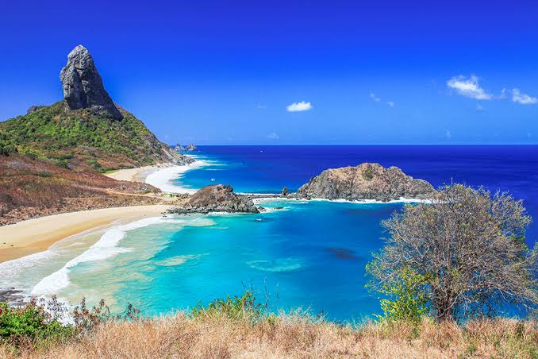
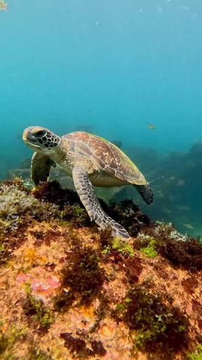
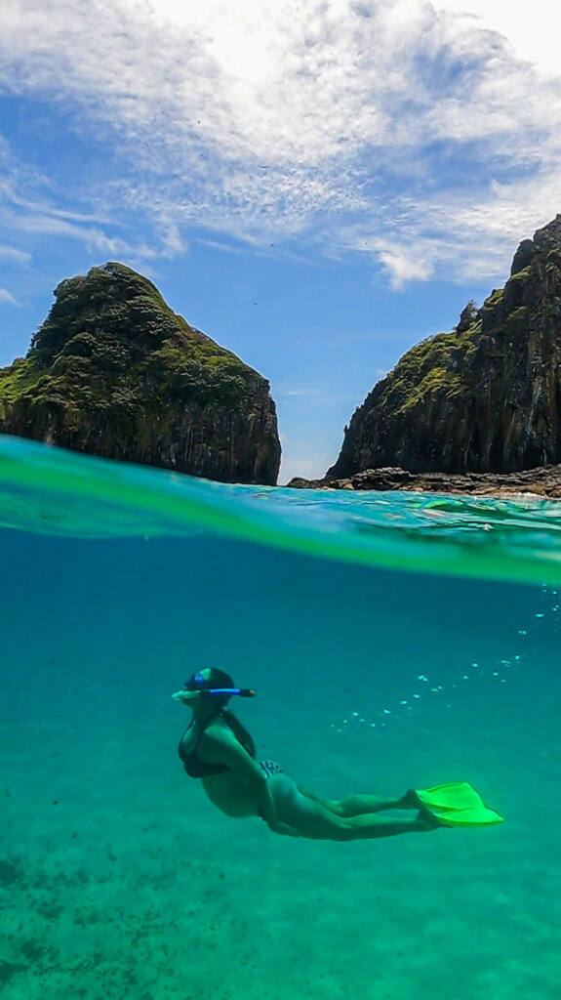
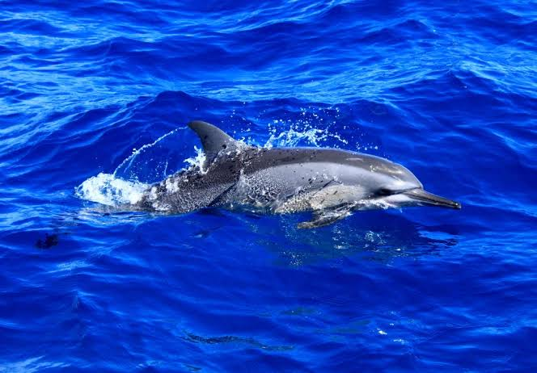
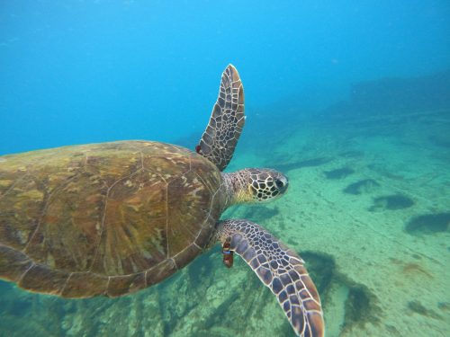
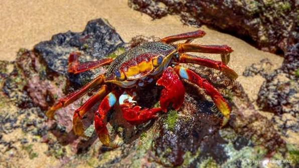

# Design do FM Noronha

Este documento descreve a identidade visual aplicada no app: um visual oceanico, escuro, fotografico e direto ao ponto, inspirado em Fernando de Noronha.

<p align="center">
  
</p>

## Direcao Visual

O app usa uma composicao de alto contraste: fotografias da ilha como base, overlays escuros para leitura, cards translucedos e acentos em azul/ciano/lavanda.

Principios:

- A foto deve ser parte da experiencia, nao decoracao solta.
- Texto branco ou lavanda sempre sobre overlay escuro.
- Botoes principais usam azul forte para acao clara.
- Cards importantes usam glass escuro com borda sutil.
- Elementos de player priorizam legibilidade e toque confortavel.

## Paleta

### Cores Usadas

<table>
  <tr>
    <td width="16%" align="center">
      <div style="width:72px;height:48px;background:#0e1513;border-radius:12px;border:1px solid rgba(255,255,255,0.16);"></div>
      <strong>Background</strong><br />
      <code>#0e1513</code>
    </td>
    <td width="16%" align="center">
      <div style="width:72px;height:48px;background:#1a211f;border-radius:12px;border:1px solid rgba(255,255,255,0.16);"></div>
      <strong>Surface</strong><br />
      <code>#1a211f</code>
    </td>
    <td width="16%" align="center">
      <div style="width:72px;height:48px;background:#0010ea;border-radius:12px;border:1px solid rgba(255,255,255,0.16);"></div>
      <strong>CTA</strong><br />
      <code>#0010ea</code>
    </td>
    <td width="16%" align="center">
      <div style="width:72px;height:48px;background:#bec2ff;border-radius:12px;border:1px solid rgba(255,255,255,0.16);"></div>
      <strong>Lavanda</strong><br />
      <code>#bec2ff</code>
    </td>
    <td width="16%" align="center">
      <div style="width:72px;height:48px;background:#00ffff;border-radius:12px;border:1px solid rgba(255,255,255,0.16);"></div>
      <strong>Ciano</strong><br />
      <code>#00ffff</code>
    </td>
    <td width="16%" align="center">
      <div style="width:72px;height:48px;background:#ff3b30;border-radius:12px;border:1px solid rgba(255,255,255,0.16);"></div>
      <strong>Live</strong><br />
      <code>#ff3b30</code>
    </td>
  </tr>
</table>

| Token              | Valor                    | Uso                       |
| ------------------ | ------------------------ | ------------------------- |
| `background`       | `#0e1513`                | Base escura geral.        |
| `surface`          | `#0e1513`                | Superficies escuras.      |
| `surfaceContainer` | `#1a211f`                | Cards e containers.       |
| `glass`            | `rgba(14, 21, 19, 0.78)` | Cards sobre imagem.       |
| `primary`          | `#bec2ff`                | Textos/icone lavanda.     |
| `primaryContainer` | `#0010ea`                | CTA principal.            |
| `secondary`        | `#a9c7ff`                | Destaques suaves.         |
| `cyanNeon`         | `#00ffff`                | Loading e pulso visual.   |
| `live`             | `#ff3b30`                | Indicador AO VIVO.        |
| `outlineMuted`     | `rgba(255,255,255,0.12)` | Bordas discretas.         |
| `deepOverlay`      | `rgba(0,0,0,0.72)`       | Overlay forte de leitura. |

Referencia no codigo: `constants/theme.ts`.

## Degrades e Overlays

Use degrades para preservar profundidade sem apagar a imagem.

### Home

Degrade vertical para a imagem da tartaruga. A parte superior fica mais fotografica e a base escurece para sustentar o CTA azul.

<div style="height:96px;border-radius:18px;background:linear-gradient(180deg, rgba(3,13,26,0.18) 0%, rgba(3,13,26,0.58) 48%, rgba(4,12,18,0.92) 100%);border:1px solid rgba(255,255,255,0.14);"></div>

```ts
const homeOverlay = ['rgba(3, 13, 26, 0.18)', 'rgba(3, 13, 26, 0.58)', 'rgba(4, 12, 18, 0.92)'];
```

### Radio

Degrade azul profundo para a tela do player. Ele preserva a paisagem, mas cria contraste para capa, titulo, card "No ar agora" e controles.

<div style="height:96px;border-radius:18px;background:linear-gradient(180deg, rgba(6,14,48,0.82) 0%, rgba(4,26,74,0.58) 42%, rgba(0,78,91,0.56) 72%, rgba(2,10,12,0.9) 100%);border:1px solid rgba(255,255,255,0.14);"></div>

```ts
const radioOverlay = [
  'rgba(6, 14, 48, 0.82)',
  'rgba(4, 26, 74, 0.58)',
  'rgba(0, 78, 91, 0.56)',
  'rgba(2, 10, 12, 0.9)',
];
```

### Cards Glass

Degrade diagonal usado como referencia para cards sobre imagem. Ele mistura superficie escura, verde-petroleo e um toque de azul da marca.

<div style="height:96px;border-radius:18px;background:linear-gradient(135deg, rgba(14,21,19,0.9) 0%, rgba(5,31,37,0.78) 52%, rgba(0,16,234,0.2) 100%);border:1px solid rgba(255,255,255,0.16);"></div>

```ts
const glassCardOverlay = [
  'rgba(14, 21, 19, 0.9)',
  'rgba(5, 31, 37, 0.78)',
  'rgba(0, 16, 234, 0.2)',
];
```

### Loading

Degrade radial para o estado "Sintonizando Noronha...". O ciano cria o ponto de energia sem competir com o texto.

<div style="height:96px;border-radius:18px;background:radial-gradient(circle at 50% 45%, rgba(0,255,255,0.18) 0%, rgba(0,255,255,0.04) 32%, rgba(0,0,0,0.94) 78%);border:1px solid rgba(255,255,255,0.14);"></div>

```ts
const tuningOverlay = ['rgba(0, 255, 255, 0.18)', 'rgba(0, 255, 255, 0.04)', 'rgba(0, 0, 0, 0.94)'];
```

### Padroes Rapidos

```ts
['rgba(3, 13, 26, 0.2)', 'rgba(3, 13, 26, 0.72)', 'rgba(4, 12, 18, 0.9)'];
```

```ts
['rgba(0, 16, 234, 0.18)', 'rgba(0, 0, 0, 0.62)'];
```

Quando a foto tiver muitos detalhes, aumente o overlay para manter contraste. Quando a foto for mais limpa, preserve mais cor do mar.

## Imagens do App

<table>
  <tr>
    <td></td>
    <td></td>
    <td></td>
  </tr>
  <tr>
    <td><strong>Home</strong><br />Imagem principal, emocional e imediata.</td>
    <td><strong>Card da radio</strong><br />Textura submarina para chamada da sintonia.</td>
    <td><strong>Sobre</strong><br />Fundo institucional com clima de ilha.</td>
  </tr>
</table>

<table>
  <tr>
    <td width="50%"></td>
    <td width="50%"></td>
  </tr>
  <tr>
    <td><strong>Notificacao e modal</strong><br />Arte wide para metadata e headers.</td>
    <td><strong>Programacao</strong><br />Detalhe decorativo leve no bottom sheet.</td>
  </tr>
</table>

## Componentes Visuais

| Componente           | Papel                                                   |
| -------------------- | ------------------------------------------------------- |
| `LiveBadge`          | Status `AO VIVO`, `GRAVADO`, `CARREGANDO` ou `OFFLINE`. |
| `WaveformVisualizer` | Movimento visual para radio tocando/carregando.         |
| `TuningLoading`      | Tela de sintonia com barra e cards de clima/mar.        |
| `RadioHeader`        | Header compacto, transparente e respeitando status bar. |
| `MidiaControls`      | Controles principais do player e acoes secundarias.     |

## Estados de Transmissao

O app usa quatro estados visuais:

| Estado       | Quando aparece                | Tom              |
| ------------ | ----------------------------- | ---------------- |
| `AO VIVO`    | Dias uteis com stream pronto. | Vermelho live.   |
| `GRAVADO`    | Sabados e domingos.           | Lavanda/azul.    |
| `CARREGANDO` | Setup/play em andamento.      | Ciano.           |
| `OFFLINE`    | Falha no stream ou conexao.   | Alerta discreto. |

Referencia no codigo: `constants/transmission.ts`.

## Regras de Layout

- Evitar rolagem na tela principal da radio em celulares comuns.
- Ajustar capa, titulo, waveform e player com base em `useWindowDimensions`.
- Usar `StatusBar` transparente/translucent no Android quando a tela for full-bleed.
- Manter cards com borda sutil para separar conteudo da imagem.
- Nao posicionar elementos criticos com porcentagens frageis como `top: '10%'` quando houver alternativa flexivel.

## Iconografia

O app usa `@expo/vector-icons`:

- `Ionicons` para navegacao, radio, compartilhar e informacao.
- `FontAwesome` e `FontAwesome6` para redes sociais especificas.
- Botoes circulares para acoes de player.
- Badges pill para status e marca.

## Acessibilidade Visual

- Texto principal sempre acima de 26px nas telas principais.
- Labels compactas em uppercase com letter spacing positivo.
- Icones em botoes com area de toque maior que o desenho visual.
- Overlay escuro sempre que imagem e texto competem.
